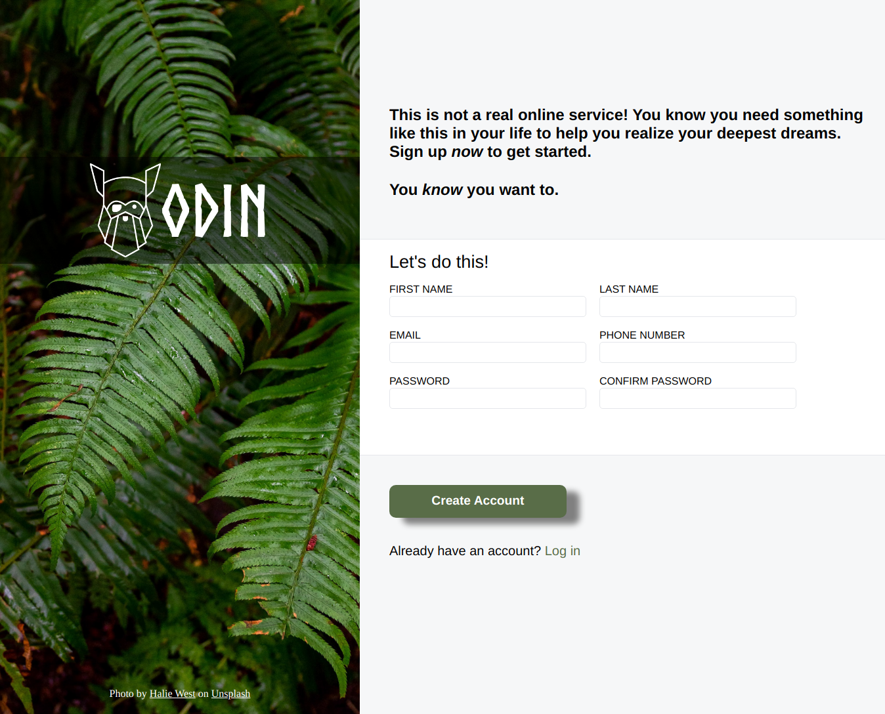
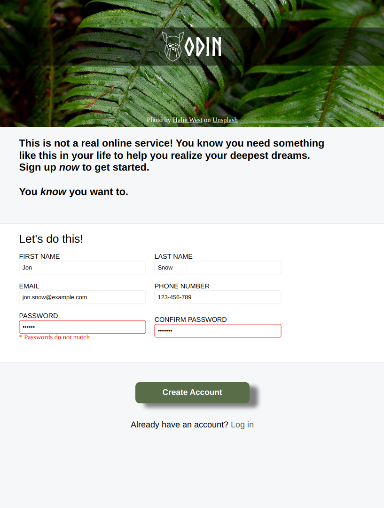
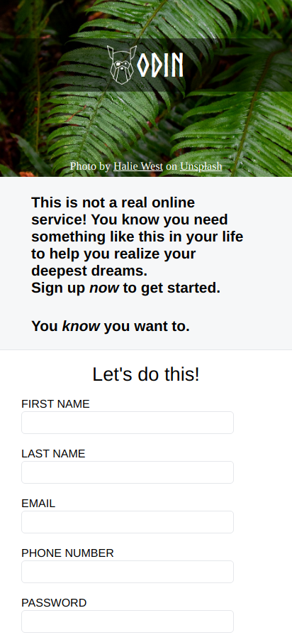

# Odin Project #6: Sign-up Form

The goal of this Odin Project assignment was to create a simple sign-up form page.

I started and finished this project in July 2022.

## Assignment

[The Odin Project - Intermediate HTML and CSS - #6 Sign-up Form](https://www.theodinproject.com/lessons/node-path-intermediate-html-and-css-sign-up-form)

## Technology

- HTML
- CSS
- Vanilla JavaScript

## Key Concepts

- Forms: inputs and labels
- Absolute and relative positioning
- Relative units: em, rem
- Custom form validation

## Features

- Password and confirm password value comparison

## Links

[Live Demo](https://brightneon7631.github.io/odin-signup-form/)

[My Other Projects](https://brightneon7631.github.io/odin-scrimba-projects/)

## Screenshots

### Desktop



### Tablet



### Mobile



## Sources for images and fonts

- https://unsplash.com/photos/25xggax4bSA by Halie West
- https://www.theodinproject.com/lessons/node-path-intermediate-html-and-css-sign-up-form by The Odin Project contributors

## Deployment

```bash
  git clone
```
